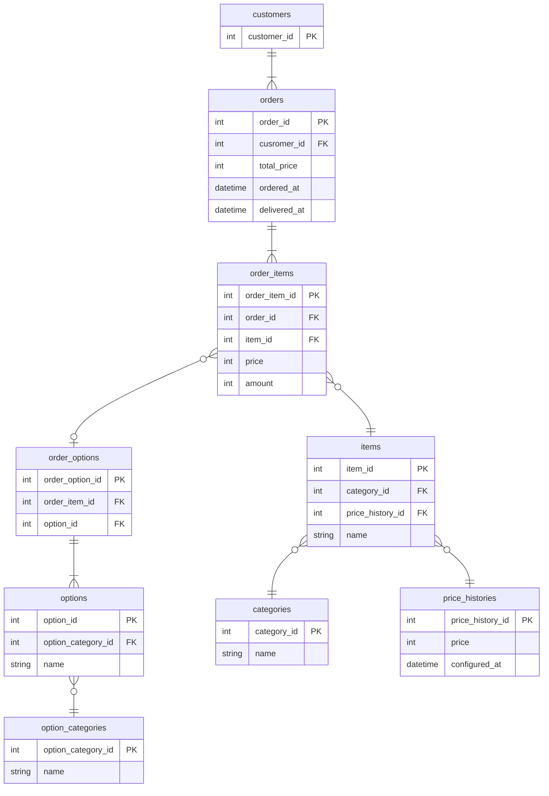

```mermaid

erDiagram
    customers{
        int customer_id PK
    }

    orders{
        int order_id PK
        int cusromer_id FK
        int total_price
        datetime ordered_at
        datetime delivered_at
    }

    order_items{
        int order_item_id PK
        int order_id FK
        int item_id FK
        int price
        int amount
    }

    order_options{
        int order_option_id PK
        int order_item_id FK
        int option_id FK
    }

    items{
        int item_id PK
        int category_id FK
        int price_history_id FK
        string name
    }

    options{
        int option_id PK
        int option_category_id FK
        string name
    }

    categories{
        int category_id PK
        string name
    }

    option_categories{
        int option_category_id PK
        string name
    }

    price_histories{
        int price_history_id PK
        int price
        datetime configured_at
    }

    customers ||--|{ orders: ""
    orders ||--|{ order_items: ""
    order_items }o--|| items: ""
    order_items }o--o| order_options: ""
    order_options ||--|{ options: ""
    items }o--|| categories: ""
    options }o--|| option_categories: ""
    items }o--|| price_histories: ""
```
